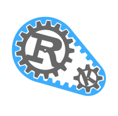

# Rust Qt Binding Generator



This code generator gets you started quickly to use Rust code from Qt and QML. In other words, it helps to create a Qt based GUI on top of Rust code.

Qt is a mature cross-platform graphical user interface library. Rust is a new programming language with strong compile time checks and a modern syntax.

To combine Qt and Rust, write an interface in a JSON file. From that, the generator creates Qt code and Rust code. The Qt code can be used directly. The Rust code has two files: interface and implementation. The interface can be used directly.

```json
{
    "cppFile": "src/person.cpp",
    "rust": {
        "dir": "rust",
        "interfaceModule": "interface",
        "implementationModule": "implementation"
    },
    "objects": {
        "Person": {
            "type": "Object",
            "properties": {
                "name": {
                    "type": "QString",
                    "write": true
                }
            }
        }
    }
}
```

This file describes an binding with one object, `Person`. `Person` has one property: `name`. It is a writable property.

The Rust Qt Binding Generator will create binding source code from this description:

```bash
rust_qt_binding_generator binding.json
```

This will create four files:

* *src/person.h*
* *src/person.cpp*
* rust/src/implementation.rs
* *rust/src/interface.rs*

Only `implementation.rs` should be changed. The other files are the binding. `implementation.rs` is initialy created with a simple implementation that is shown here with some comments.

```rust
use interface::*;

/// A Person
pub struct Person {
    /// Emit signals  the the Qt code.
    emit: PersonEmitter,
    /// The name of the person.
    name: String,
}

/// Implementation of the binding
impl PersonTrait for Person {
    /// Create a new person with default data.
    fn new(emit: PersonEmitter) -> Person {
        Person {
            emit: emit,
            name: String::new(),
        }
    }
    /// The emitter can emit signals to the Qt code.
    fn emit(&self) -> &PersonEmitter {
        &self.emit
    }
    /// Get the name of the Person
    fn get_name(&self) -> &str {
        &self.name
    }
    /// Set the name of the Person
    fn set_name(&mut self, value: String) {
        self.name = value;
        self.emit.name_changed();
    }
}
```

The building block of Qt and QML projects are QObject and the Model View classes. `rust_qt_binding_generator` reads a json file to generate QObject or QAbstractItemModel classes that call into generated Rust files. For each type from the JSON file, a Rust trait is generated that should be implemented.

This way, Rust code can be called from Qt and QML projects.

## More information

* [The QML Book](https://qmlbook.github.io/)
